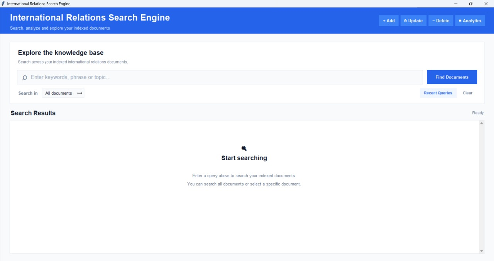
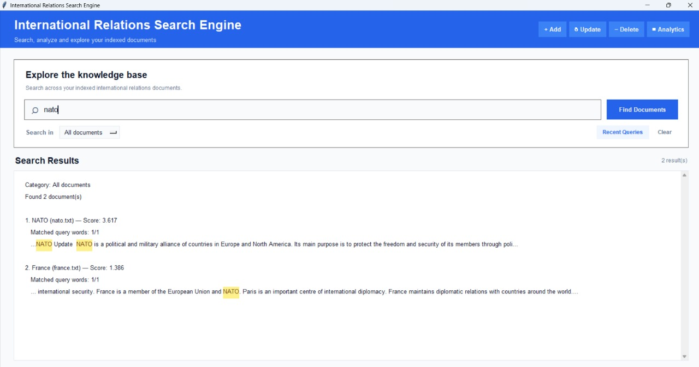
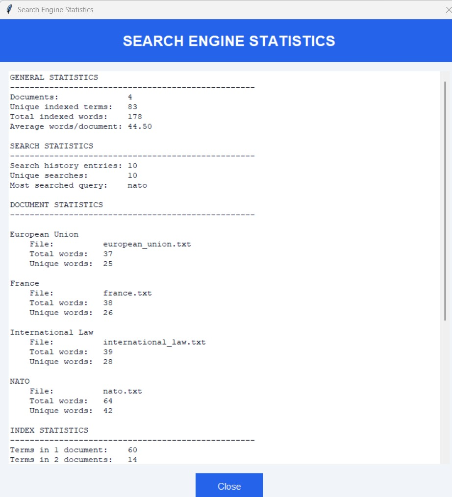
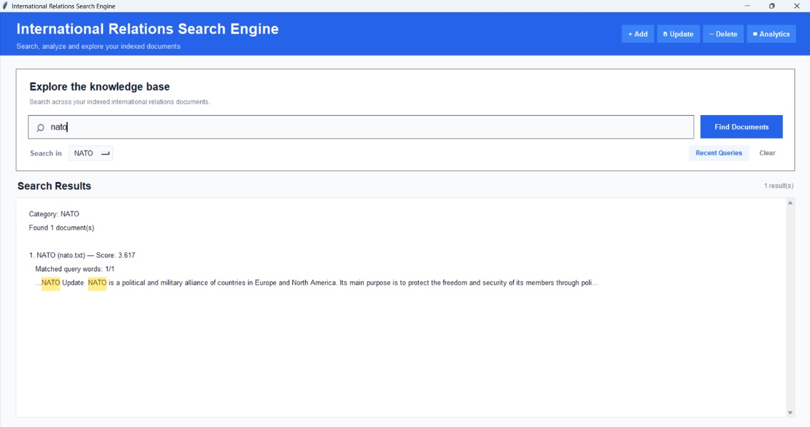

# International Relations Search Engine



A Python-based desktop search engine for searching and analyzing a collection of international relations documents.

The project demonstrates how a basic search engine works internally, including document indexing, inverted indexes, document frequency, TF-IDF ranking, Boolean search, stemming, snippets, result highlighting, search history, document filtering, document management, search statistics, and a graphical user interface built with Tkinter.

---

## Features

### Search Engine

- Document indexing for `.txt` files
- Inverted index
- Document frequency (DF)
- TF-IDF calculation
- Relevance-based result ranking
- Search snippets
- AND / OR Boolean search
- Exact phrase search
- Porter stemming
- Stop-word filtering
- Result highlighting

### Search Management

- Search history
- Document filtering
- Advanced search
- Improved ranking
- Automatic index rebuilding
- Search across all documents or a selected document

### Document Management

- Add new documents directly through the GUI
- Delete documents through the GUI
- Update existing documents through the GUI
- Automatic index rebuilding after document changes
- Case-insensitive document name mapping

### Statistics

- Total number of indexed documents
- Number of unique indexed terms
- Total indexed words
- Average words per document
- Search history statistics
- Most searched query
- Per-document statistics
- Document frequency distribution
- Top 10 most frequent terms
- Index consistency check

### Graphical User Interface

- Modern Tkinter-based interface
- Search bar with placeholder text
- Document filter dropdown
- Search results area
- Result highlighting
- Search status indicator
- Recent queries button
- Clear search button
- Add, update and delete document controls
- Search Engine Statistics window
- Empty search state

---

## About the Project

This project is a desktop search engine developed in Python using Tkinter.

The main purpose of the project is to demonstrate how a basic search engine works internally and how different information retrieval techniques can be combined into a single application.

The search engine works with local `.txt` documents stored in the `documents` folder.

The project includes both the search engine logic and a graphical user interface that allows the user to search, manage documents, view search history, and analyze indexing statistics.

---

## Project Architecture

The search engine is organized into several logical components that work together to process documents, build the search index, process user queries, rank results, and present them through the graphical interface.

### 1. Text Processing

The text processing layer prepares documents and search queries for indexing and retrieval.

Main functions:

- `normalize_word()`
- `tokenize()`
- `normalized_tokens()`
- `clean_query()`

The processing pipeline includes:

```text
Raw text
    ↓
Tokenization
    ↓
Stop-word removal
    ↓
Porter stemming
    ↓
Normalized terms

---

## Screenshots

### Main Interface


### Search Results



### Search Engine Statistics



### Document Filtering


---

## How It Works

The search engine processes documents through several stages.

### 1. Document Collection

All `.txt` documents are stored in the `documents` folder.

When the application starts, it scans this folder and finds all available text documents.

New documents can also be added directly through the graphical interface.

### 2. Tokenization

The text of each document is divided into individual words.

Punctuation and unnecessary characters are removed during the processing stage.

For example:

```text
International organizations play an important role.
```

is processed into individual tokens.

### 3. Stop Word Removal

Common words that provide little information for search are removed.

Examples include:

```text
the
a
an
is
are
and
or
of
in
to
for
```

This reduces unnecessary entries in the search index.

### 4. Stemming

The search engine uses the Porter Stemmer from NLTK.

Stemming converts related word forms to a common stem.

For example, words such as:

```text
treaty
treaties
```

can be reduced to related stems during processing.

This allows the search engine to handle different word forms more effectively.

### 5. Inverted Index

The search engine creates an inverted index that maps each normalized term to the documents containing that term.

For example:

```text
nato   → [nato.txt, france.txt]
treati → [international_law.txt]
europe → [european_union.txt, france.txt]
```

This allows the search engine to quickly determine which documents contain a searched term.

### 6. Document Frequency

For every indexed term, the search engine calculates its document frequency (DF).

DF represents the number of documents containing a particular term.

For example:

```text
Term: nato
Documents containing the term: 2
DF = 2
```

### 7. TF-IDF

The search engine calculates TF-IDF scores to estimate how important a term is within a document.

Term Frequency (TF) measures how frequently a term appears in a document.

Inverse Document Frequency (IDF) measures how rare the term is across the document collection.

The project uses:

```text
IDF = log(N / DF)
```

where:

- `N` is the total number of indexed documents
- `DF` is the number of documents containing the term

The TF-IDF score is then used during result ranking.

### 8. Search

When the user enters a query, the query is processed using the same normalization and stemming logic as the documents.

The search engine supports:

- Normal keyword search
- AND queries
- OR queries
- Exact phrase search
- Document filtering

### 9. Result Ranking

Matching documents are ranked according to their relevance to the query.

The ranking considers:

- TF-IDF score
- Number of matched query terms
- Match ratio

Documents with higher relevance receive higher scores and appear first.

### 10. Snippets and Highlighting

For every search result, the application displays a short text snippet from the matching document.

The searched terms are highlighted so that the user can immediately see where the match occurs.

### 11. Search History

Search queries are stored in a local JSON file.

The application keeps the most recent queries and allows the user to view them through the GUI.

### 12. Document Management

Documents can be managed directly from the application.

The user can:

- Add new `.txt` documents
- Update existing documents
- Delete documents

After a document is added, updated, or deleted, the search index is rebuilt automatically.

### 13. Statistics

The application can calculate and display search engine statistics, including:

- Number of indexed documents
- Number of unique indexed terms
- Total indexed words
- Average words per document
- Search history statistics
- Document-level statistics
- Document frequency distribution
- Most frequent indexed terms
- Statistics consistency check

---

## Project Structure

The current project structure is:

```text
International Relations Search Engine/
│
├── documents/
│   ├── european_union.txt
│   ├── france.txt
│   ├── international_law.txt
│   └── nato.txt
│
├── main.py
├── main_before_stemming.py
├── main_tfidf.py
├── main_working.py
├── README.md
└── search_history.json
```

### Main Files

#### `documents/`

Contains the `.txt` documents used by the search engine.

The application automatically scans this folder and indexes the available documents.

#### `main.py`

The current main version of the search engine.

It contains:

- Document indexing
- Inverted index construction
- Document frequency calculation
- TF-IDF calculation
- Search
- AND / OR queries
- Exact phrase search
- Result ranking
- Snippet generation
- Result highlighting
- Search history
- Document filtering
- Document management
- Search statistics
- Graphical user interface

#### `search_history.json`

Stores recent search queries.

The file is automatically created and updated by the application.

#### `README.md`

Contains the documentation for the project.

#### Previous Development Files

The project also contains previous development versions:

- `main_before_stemming.py`
- `main_tfidf.py`
- `main_working.py`

These files represent earlier stages of development and experimentation.

---

## Technologies Used

The project was developed using the following technologies:

- **Python** — main programming language
- **Tkinter** — graphical user interface
- **NLTK** — natural language processing and Porter stemming
- **JSON** — search history storage
- **Regular Expressions** — text tokenization and query processing
- **TF-IDF** — document relevance calculation
- **Inverted Index** — efficient document retrieval
- **Git / GitHub** — version control and project hosting

---

## Installation

### 1. Install Python

Make sure Python 3.10 or newer is installed on your computer.

Check the installed version with:

```bash
python --version
```

### 2. Install Dependencies

Install NLTK:

```bash
pip install nltk
```

Tkinter is normally included with standard Python installations.

### 3. Clone the Repository

After the project is published on GitHub, clone the repository using:

```bash
git clone https://github.com/USERNAME/REPOSITORY.git
```

Then enter the project directory:

```bash
cd REPOSITORY
```

> `USERNAME/REPOSITORY` will be replaced with the actual GitHub repository address in the final version.

### 4. Run the Application

Run the main application:

```bash
python main.py
```

---

## Requirements

The project requires:

- Python 3.10 or newer
- Tkinter
- NLTK

The search engine works with local `.txt` documents and does not require an internet connection for normal searching.

---

## First Launch

When the application starts, it:

1. Creates the `documents` folder if it does not exist.
2. Detects available `.txt` documents.
3. Builds the inverted index.
4. Calculates document frequency.
5. Calculates IDF values.
6. Prepares the search engine for queries.
7. Loads the existing search history.
8. Opens the graphical interface.

After startup, the user can immediately search the indexed documents.

---

## Usage

After launching the application, the main search window will appear.

### Searching Documents

1. Enter a search query in the search field.
2. Select a document from the **Search in** filter if you want to search only within a specific document.
3. Leave **All documents** selected to search across the entire document collection.
4. Click **Find Documents** or press `Enter`.
5. The application will display the matching documents ranked by relevance.

For example:

```text
nato
```

or:

```text
international law
```

The results may include:

- Document name
- Matching query words
- Relevance score
- Text snippet
- Highlighted search terms

### AND Search

Use `AND` when all specified terms must be present in the document.

Example:

```text
nato AND security
```

Only documents containing both terms will be returned.

### OR Search

Use `OR` when at least one of the specified terms should be present.

Example:

```text
nato OR european
```

Documents containing either term can be returned.

### Exact Phrase Search

Use quotation marks to search for an exact phrase.

Example:

```text
"international law"
```

The application searches for the specified sequence of normalized words.

### Document Filtering

The **Search in** dropdown allows the user to limit the search to a specific document.

Select:

```text
All documents
```

to search the entire collection.

### Search History

Click **Recent Queries** to view recently used search queries.

The application stores the search history in:

```text
search_history.json
```

### Clear Search

Click **Clear** to:

- Remove the current query
- Reset the document filter
- Clear the results
- Return the interface to the initial state

### Adding Documents

Click **+ Add** in the header.

Then:

1. Select a `.txt` file.
2. Confirm the file.
3. The document is copied into the `documents` folder.
4. The search index is rebuilt automatically.
5. The new document becomes available for searching.

### Updating Documents

Select a specific document using the **Search in** filter.

Then click **↻ Update**.

Select a new `.txt` file whose contents should replace the selected document.

After the update, the search index is rebuilt automatically.

### Deleting Documents

Click **− Delete**.

Select the document you want to remove and confirm the deletion.

The document is removed from the `documents` folder and the search index is rebuilt automatically.

### Search Engine Statistics

Click **▥ Analytics** to open the statistics window.

The statistics include:

- Total number of indexed documents
- Number of unique indexed terms
- Total indexed words
- Average words per document
- Search history statistics
- Document statistics
- Document frequency distribution
- Most frequent indexed terms
- Statistics consistency check

### Keyboard Shortcut

Press:

```text
Ctrl + F
```

to quickly focus the search field.

---

## Testing

The project will be tested to verify that both the search engine logic and the graphical interface work correctly.

Testing focuses on the main functions of the application and on preventing regressions when documents or search features are changed.

### Main Test Areas

The following functionality will be tested:

- Document loading
- Document indexing
- Inverted index construction
- Document frequency calculation
- TF-IDF calculation
- Search result ranking
- Keyword search
- AND search
- OR search
- Exact phrase search
- Stemming
- Search result highlighting
- Search snippets
- Search history
- Document filtering
- Adding documents
- Updating documents
- Deleting documents
- Search engine statistics
- GUI interactions
- Empty search queries
- Empty document handling
- Invalid file handling
- Missing document handling
- Index rebuilding

### Manual GUI Testing

The graphical interface will be manually tested by performing typical user actions.

Examples include:

1. Launching the application.
2. Searching for a common term.
3. Searching for a term that exists in only one document.
4. Performing an AND search.
5. Performing an OR search.
6. Searching for an exact phrase.
7. Selecting a specific document from the filter.
8. Adding a new document.
9. Updating an existing document.
10. Deleting a document.
11. Opening the statistics window.
12. Viewing recent search queries.
13. Clearing the search.
14. Using the `Ctrl + F` shortcut.
15. Searching for a term that does not exist.

### Expected Behaviour

The application should:

- Return correct matching documents.
- Rank relevant documents appropriately.
- Display useful snippets.
- Highlight matching terms.
- Respect the selected document filter.
- Rebuild the index after document changes.
- Prevent invalid documents from being added.
- Handle missing or unreadable files safely.
- Display meaningful messages when no results are found.
- Keep the graphical interface responsive and usable.

### Test Results

Detailed test results will be added after the final testing stage of the project.

The final version will include information about:

- Tests performed
- Expected results
- Actual results
- Passed tests
- Failed tests
- Issues discovered and fixed

---

## Limitations and Future Improvements

Although the search engine provides the main functionality expected from a document search system, there are several areas that could be improved in future versions.

### Current Limitations

- The search engine currently works with local `.txt` documents.
- The tokenizer is primarily designed for English-language text.
- Porter stemming is optimized for English words.
- The graphical interface is built with Tkinter and uses a desktop application layout.
- The search index is rebuilt when documents are added, updated, deleted, or when a search is performed.
- The project is designed primarily as an educational demonstration of search engine concepts rather than a production-scale search system.

### Possible Future Improvements

Future versions could include:

- Support for additional document formats such as PDF and DOCX.
- Improved multilingual text processing.
- More advanced natural language processing.
- Better semantic search.
- Support for synonyms.
- Fuzzy search for misspelled queries.
- More advanced ranking algorithms.
- Search result pagination.
- More detailed analytics and visual statistics.
- Exporting search results and statistics.
- Persistent pre-built indexes for faster startup.
- Improved GUI animations and interactions.
- A web-based version of the search engine.
- A larger document collection for performance testing.

These improvements could make the project more scalable and suitable for larger collections of documents.

---

## License

This project is currently provided for educational and demonstration purposes.

The source code may be used for learning and experimentation.

A formal open-source license may be added in the final GitHub release.